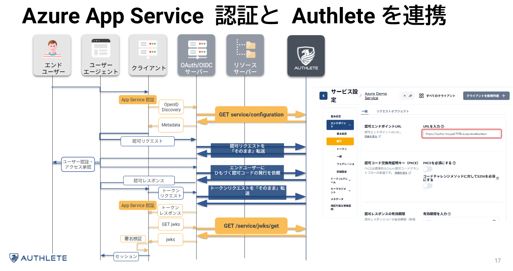

# Authlete App Service sample

このサンプルは Authlete Server を利用した認可サーバーと、認可サーバーを利用するクライアント、リソースサーバーを App Service 上に展開するサンプルです。
展開されるアプリは以下の 3 つです。

- 認可サーバー: [authzServer](src/java-oauth-server/)
- クライアント Web アプリ: [client](src/client/)
- リソースサーバー: [api](src/api/)

authzServer は [java-oauth-server](https://github.com/authlete/java-oauth-server) で公開されている Authlete の Java リファレンス実装で、この認可サーバーは Authlete 3.0 にリクエストを転送することで認可サーバーとしての機能を実装しています。
`client` は認可サーバーのクライアントとして動作し、OpenID Connect と OAuth プロトコルで ID トークンとアクセストークンを取得します。
取得したアクセストークンはリソースサーバーである `api` に提示することで、リソースアクセスが可能となります。

## Authlete の設定

Authlete サーバーの発行するアクセストークンは既定では識別子型のトークンです。Azure では Microsoft Entra ID が内包型トークンを発行するため、多くのサービスが内包型トークン前提で動作します。
たとえば App Service 認証や、API Management の validate-jwt ポリシーなどです。

Authlete では設定次第で内包型 (正確には識別子も内包するハイブリッド型) のトークンが発行できるため、Authlete API を組み込んだ認可サーバーを簡単に Azure と統合することができます。

### サービス設定

認可サーバーが Authlete API にアクセスするにはサービス アクセス トークンが必要です。
必要なトークンは [hooks/prerestore.ps1](hooks/prerestore.ps1) で入力を求められますので、[Authlete コンソール](https://console.authlete.com) から必要な情報を取得してください。
入力した値をもとにスクリプト内で [java-oauth-server](src/java-oauth-server/) 用の properties ファイルを生成しデプロイに含めます。

### OpenID Discovery Endpoint

App Service 認証では外部 OpenID Provider の Discovery Endpoint からメタデータを取得し、ID トークンやアクセストークンの検証に利用します。
Authlete の `service/configuration` API を利用することで、メタデータを生成することが可能ですが、それには認可サーバーが動作しているドメインを含む、認可エンドポイント、トークンエンドポイントなどの追加が必要です。
[hooks/postdeploy.ps1](hooks/postdeploy.ps1) ではデプロイした認可サーバーのデフォルトドメインをもとに、Autlete のサービス設定を自動で更新します。



またクライアントが参照する OpenID Discovery Endpoint については、[infra/main.bicep](infra/main.bicep) 内で各デフォルトドメインをもとに `authsettingsV2` 設定として自動で追加されます。

## App Service 認証からトークンを取得する手順

App Service 認証をクリアすると、アプリケーションコードに以下のヘッダーが応答されますので、そのヘッダーから必要なクレームなどを取得します。

- X-MS-CLIENT-PRINCIPAL-IDP (App Service 認証で設定した IdP の名称, ここでは authlete)
- X-MS-CLIENT-PRINCIPAL (App Service 認証が受け取ったトークンから取得したクレームのリスト)

X-MS-CLIENT-PRINCIPAL のサンプル

```json
{"auth_typ":"authlete","claims":[{"typ":"iss","val":"https:\/\/authz-mccpzlr747kro.azurewebsites.net"},{"typ":"http:\/\/schemas.xmlsoap.org\/ws\/2005\/05\/identity\/claims\/nameidentifier","val":"1003"},{"typ":"aud","val":"1973559295"},{"typ":"exp","val":"1744543444"},{"typ":"iat","val":"1744457044"},{"typ":"http:\/\/schemas.microsoft.com\/ws\/2008\/06\/identity\/claims\/authenticationinstant","val":"1744457042"},{"typ":"nonce","val":"14e401139b0547fcabba9faab208abed_20250412112857"},{"typ":"s_hash","val":"P--AZkfNLiZJeZoGJxLGlA"}],"name_typ":"http:\/\/schemas.xmlsoap.org\/ws\/2005\/05\/identity\/claims\/name","role_typ":"http:\/\/schemas.microsoft.com\/ws\/2008\/06\/identity\/claims\/role"}
```

ヘッダーを解析するサンプルコードは [AppServiceAuthenticationExternalProviderHandler.cs](src/client/AppServiceAuthenticationExternalProvider/AppServiceAuthenticationExternalProviderInformation.cs) にあります。

### App Service 認証の制約

App Service 認証の制約として以下があげられます。

- 認証を強制した際、外部 OpenID プロバイダーでは authorization request を編集できない
- API として設定するとき allowed Audience の設定ができない

いずれも Microsoft Entra ID を IdP とした際には問題とならないのですが、外部 OpenID プロバイダーを利用すると設定項目がないので対処する必要があります。

### 認証を強制した際、外部 OpenID プロバイダーでは authorization request を編集できない

authorization request を編集できない問題については、App Service 認証を強制せず、 `/.auth/login/<idpname>` に追加のクエリパラメーターを送信することで回避できます。
例えば `/.auth/login/authlete?scope=openid%20profile%20Files.Read` のようなクレームを送信すると、`<認可サーバーの認可エンドポイント>?scope=openid%20profile%20Files.Read&<その他のクエリ>` のように、App Service 認証が作成する認可リクエストを上書きできます。

ただ、このエンドポイントを利用するには、App Service 認証にて匿名アクセスを許可する必要があります。
ユーザーが App Service 認証を突破済みかは、[AppServiceAuthenticationExternalProviderHandler.cs](src/client/AppServiceAuthenticationExternalProvider/AppServiceAuthenticationExternalProviderInformation.cs) で取得したクレームが存在するかを判定するミドルウェア [AppServiceAuthenticationExternalProviderHandler.cs](src/client/AppServiceAuthenticationExternalProvider/AppServiceAuthenticationExternalProviderHandler.cs) を Builder に追加することで実現しています。

```cs
builder.Services
    .AddHttpClient()
    .AddLogging()
    .AddAuthorization()
    .AddAuthentication(option =>
    {
        option.DefaultAuthenticateScheme = AppServiceAuthenticationExternalProviderDefaults.AuthenticationScheme;
        option.DefaultChallengeScheme = AppServiceAuthenticationExternalProviderDefaults.AuthenticationScheme;
    })
    .AddScheme<AppServiceAuthenticationOptions, AppServiceAuthenticationExternalProviderHandler>(
        AppServiceAuthenticationExternalProviderDefaults.AuthenticationScheme, options =>
        {
            options.responseStatusCode = StatusCodes.Status302Found;
            options.authorizationOpetionQueries = "resource=" + Environment.GetEnvironmentVariable("RESOURCE_IDENTIFIER");
            options.nameType = "preferred_username";
            options.roleType = ClaimsIdentity.DefaultRoleClaimType;
        }
    );
```

### API として設定するとき allowed Audience の設定ができない

JWT を検証する際の受け入れるべき `aud` について、Microsoft Entra ID では `許可されるトークン対象ユーザー` (allowed token audience) で設定可能なのですが、カスタム OpenID Provider では設定できません。
かなり無理やりですが、クライアント ID に API の `aud` を設定することで、App Service 認証が正しく `aud` の検証をできるようにしています。

## Note

クライアントから認可サーバーに認可リクエストを送信した際、以下のエラーが表示されることがあります。

```
{"resultCode":"A001101","resultMessage":"[A001101] /auth/authorization/direct, Authlete Server error."}
```

これは認可サーバーの URL を Authlete サービスに設定する前に Easy Auth が認可サーバーの OpenID Connect Discovery Endopoint にアクセスし、誤ったメタデータ (デフォルトでのメタデータ) をキャッシュすることでおこります。
この場合デプロイされた client および api の [設定] > [認証] から `authlete (カスタム プロバイダー)` のメタデータ URL を適当な値に変更し保存後、再度元の値に戻してください。※ キャッシュにより反映に時間がかかります。

またこのサンプルはシークレットなどを azd env に平文で保存しています。本番環境などでは Key Vault を利用し azd env set-secret などを利用するようにしてください。